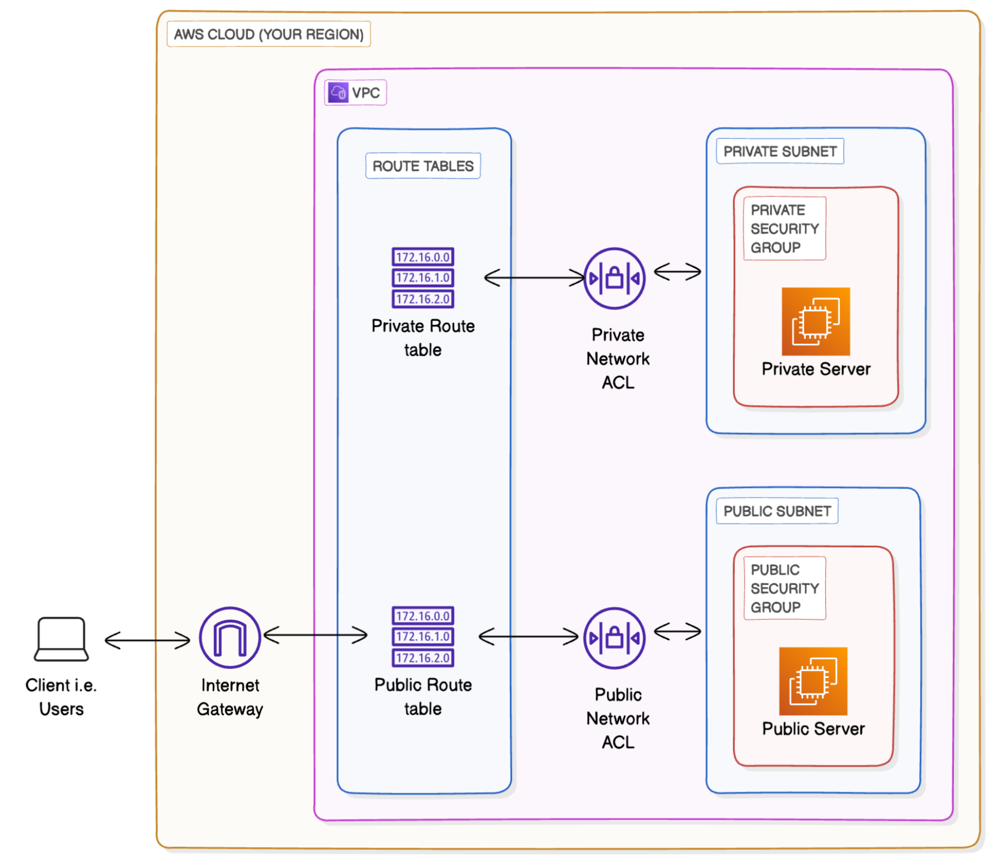
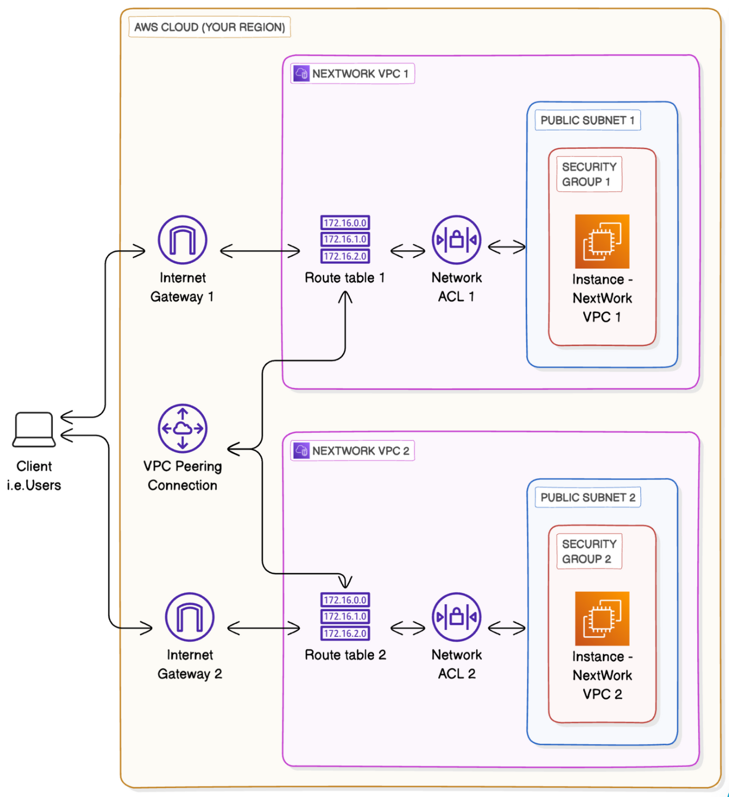
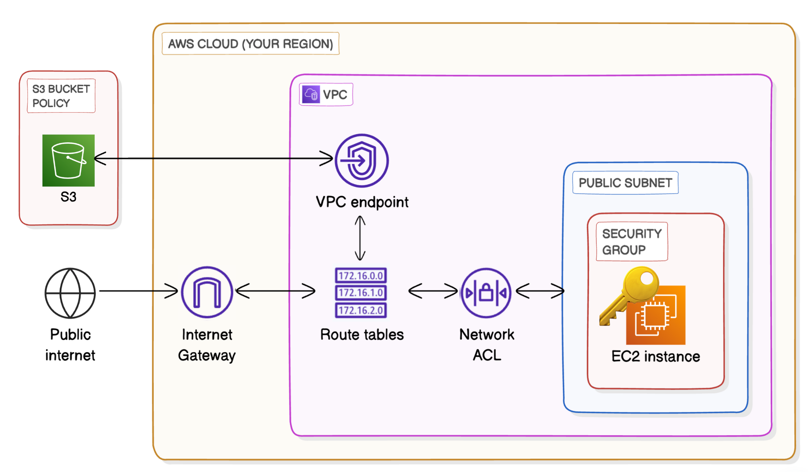

# AWS Infrastructure with Terraform

## Project Overview

This project demonstrates a comprehensive AWS cloud infrastructure setup using Terraform as Infrastructure as Code (IaC). It showcases enterprise-level networking, security, and service integration patterns commonly used in production environments.

### What This Project Demonstrates

- **Multi-VPC Architecture** with public and private subnets
- **VPC Peering** for secure inter-VPC communication
- **VPC Endpoints** for private AWS service access
- **Security Groups** and **Network ACLs** for layered security
- **IAM Roles and Policies** for secure service access
- **S3 Integration** with secure, private connectivity
- **Terraform Best Practices** with modular, reusable code

## Architecture Diagrams

### 1. Primary VPC with Public/Private Subnets

### 2. VPC Peering Configuration

### 3. S3 VPC Endpoint Integration

## Features

### Core Infrastructure
- ✅ **VPC** with custom CIDR blocks (172.16.0.0/16, 10.0.0.0/16)
- ✅ **Public Subnet** with Internet Gateway access
- ✅ **Private Subnet** for internal resources only
- ✅ **Route Tables** with appropriate routing rules
- ✅ **Internet Gateway** for public internet access

### Security
- ✅ **Security Groups** with principle of least privilege
- ✅ **Network ACLs** for subnet-level firewall rules
- ✅ **IAM Roles & Policies** for EC2-to-S3 access
- ✅ **S3 Bucket Policies** restricting access to VPC endpoint only

### Connectivity
- ✅ **VPC Peering** between multiple VPCs
- ✅ **VPC Endpoints** for private AWS service access
- ✅ **Cross-VPC Security Group** references

### Compute & Storage
- ✅ **EC2 Instances** in both public and private subnets
- ✅ **S3 Bucket** with encryption and versioning
- ✅ **Instance Profiles** for secure AWS API access

## Technologies Used

- **Terraform** - Infrastructure as Code
- **AWS** - Cloud Provider
  - VPC, Subnets, Route Tables
  - EC2, Security Groups, NACLs
  - S3, VPC Endpoints
  - IAM Roles & Policies
  - Internet Gateway

## Credits

This project was originally inspired by a guided AWS GUI-based infrastructure build from [NextWork](https://www.nextwork.org/). While the conceptual foundation and architecture were developed during that course, the entire Terraform implementation was done independently by me. \
Link for project on NextWork: [https://learn.nextwork.org/projects/aws-networks-intro](https://learn.nextwork.org/projects/aws-networks-intro)
